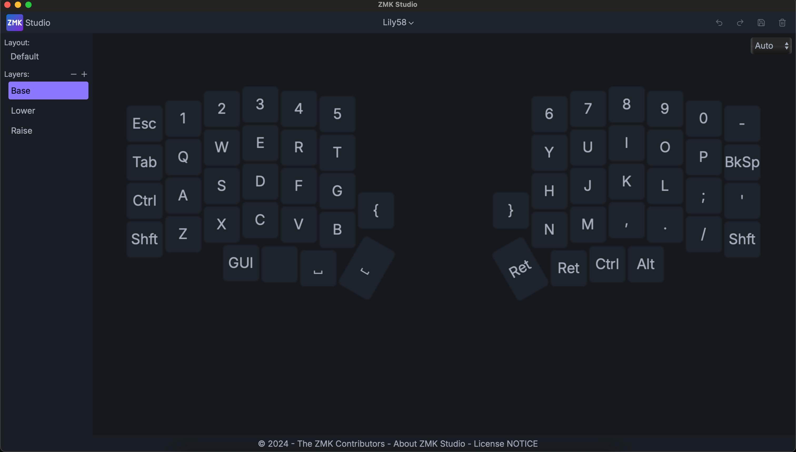
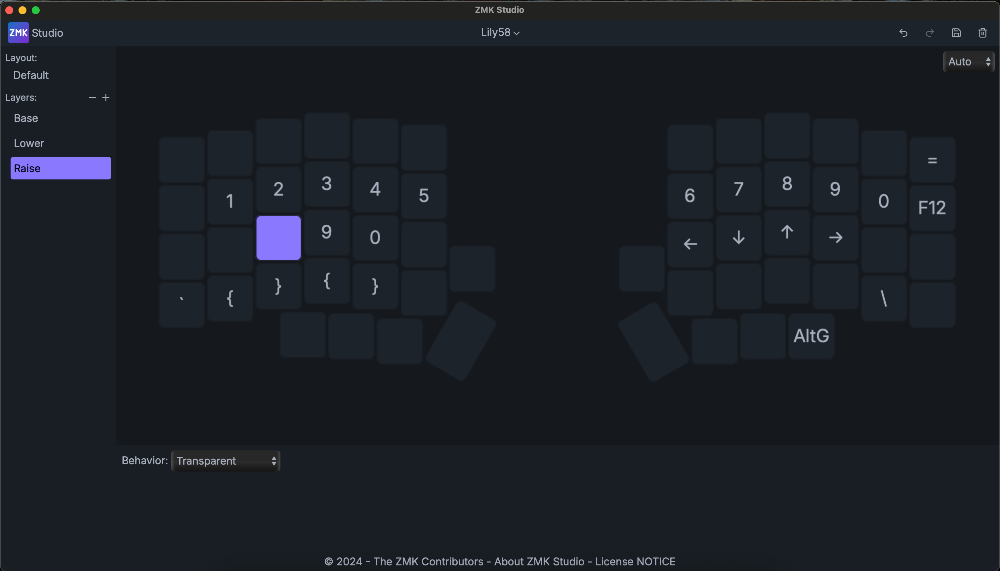
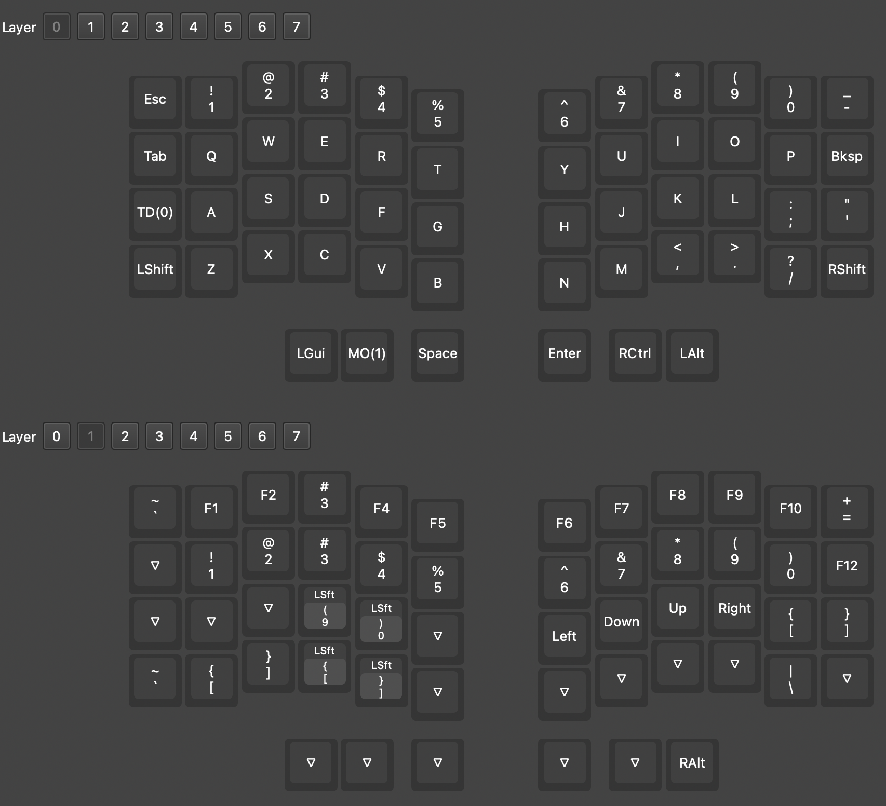

# silakka54_wifi

Contents of the wireless "silakka54" that I received from Glorya 3C store that seems to be configured as a lily58. Works fine with zmk studio (for now), but wouldn't want to have to reset it.

This is documented for my own purposes. This repo will only be useful if you have the exact same board. Back up your firmware before doing anything.

## resetting the pairing

I have had some issues with loss of pairing between the slave (right) and the master (left), resulting in only the master connecting to the computer.

To reset the pairing, assuming both boards are turned off:

1. Connect the right board to computer using USB-C cable.

2. Double press the small button on the edge/underside of board (close to the bottom of the nice nano). This should cause the board to be detected as a storage device.

3. Copy `zmk_clear.uf2` to the board. On my mac this was:

```sh
cp flash/zmk_clear.uf2 /Volumes/NICENANO/
```

4. This will trigger a reboot of the board and likely cause some device disconnetion warnings. Ignore them and double press the button to again mount the board as a storage device.

5. Copy the firmware to the board:

```sh
cp right/CURRENT.UF2 /Volumes/NICENANO/
```

6. Again, this will trigger a reboot of the board. Disconnect the right board from the USB-C, and connect the left board to the computer using USB-C cable. Repeat 2-4. Then finally copy the firmware for the left board:

```sh
cp left/CURRENT.UF2 /Volumes/NICENANO/
```

7. Disconnect the left board from the USB-C. 

8. Swith on both boards and simultaneously press the button on both boards. This should cause them to pair with each other. 

9. You should now be able to connect via bluetooth to the master board and use both boards.





## wired layout in vial



